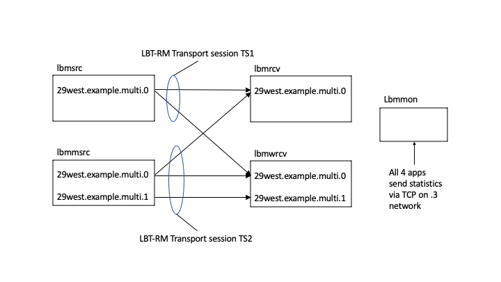

# um_troubleshoot
Sample multicast troubleshooting session with Ultra Messaging.

# Table of contents

- [um_troubleshoot](#um_troubleshoot)
- [Table of contents](#table-of-contents)
- [COPYRIGHT AND LICENSE](#copyright-and-license)
- [REPOSITORY](#repository)
- [INTRODUCTION](#introduction)
  - [Test Setup](#test-setup)
- [PREPARATION](#preparation)
- [MONITORING DATA](#monitoring-data)
    - [Recommendation 1](#recommendation-1)
- [RECEIVER LOG FILE](#receiver-log-file)
- [PACKET CAPTURE ANALYSIS](#packet-capture-analysis)
  - [Find First NAK](#find-first-nak)
    - [Find the Corresponding Data Packets](#find-the-corresponding-data-packets)
  - [Find First NCF](#find-first-ncf)
    - [Recommendation 2](#recommendation-2)
  - [Tail Loss](#tail-loss)
    - [Recommendation 3](#recommendation-3)
    - [Recommendation 4](#recommendation-4)
  - [Low Unrecoverable Loss Count](#low-unrecoverable-loss-count)
  - [Session Messages](#session-messages)
  - [TEST REPRODUCTION](#test-reproduction)

<sup>(table of contents from https://luciopaiva.com/markdown-toc/)</sup>

# COPYRIGHT AND LICENSE

All of the documentation and software included in this and any
other Informatica Ultra Messaging GitHub repository
Copyright (C) Informatica. All rights reserved.

Permission is granted to licensees to use
or alter this software for any purpose, including commercial applications,
according to the terms laid out in the Software License Agreement.

This source code example is provided by Informatica for educational
and evaluation purposes only.

THE SOFTWARE IS PROVIDED "AS IS" AND INFORMATICA DISCLAIMS ALL WARRANTIES
EXPRESS OR IMPLIED, INCLUDING WITHOUT LIMITATION, ANY IMPLIED WARRANTIES OF
NON-INFRINGEMENT, MERCHANTABILITY OR FITNESS FOR A PARTICULAR
PURPOSE.  INFORMATICA DOES NOT WARRANT THAT USE OF THE SOFTWARE WILL BE
UNINTERRUPTED OR ERROR-FREE.  INFORMATICA SHALL NOT, UNDER ANY CIRCUMSTANCES,
BE LIABLE TO LICENSEE FOR LOST PROFITS, CONSEQUENTIAL, INCIDENTAL, SPECIAL OR
INDIRECT DAMAGES ARISING OUT OF OR RELATED TO THIS AGREEMENT OR THE
TRANSACTIONS CONTEMPLATED HEREUNDER, EVEN IF INFORMATICA HAS BEEN APPRISED OF
THE LIKELIHOOD OF SUCH DAMAGES.

# REPOSITORY

See https://github.com/UltraMessaging/um_troubleshoot for code and documentation.

# INTRODUCTION

This repository is intended to train Ultra Messaging users
to perform some simple troubleshooting using monitoring data
and a packet capture.

Informatica recommends that UM-based applications and daemons configure [Automatic Monitoring](https://ultramessaging.github.io/currdoc/doc/Operations/monitoring.html#automaticmonitoring).
Informatica also recommends the use of an "always-on" packet capture appliance, like [Pico's Corvil](https://www.pico.net/corvil-analytics/corvil-classic/).

Although this example was somewhat contrived to demonstrate techniques,
all of the issues here have also been found in real life with customers.

There are several problems with the code and configuration that we
will diagnose together with the steps below.
Each sub-section titled "Recommendation X" contains the recommended
solution to a diagnosed problem.

For a deeper explanation of enabling automatic monitoring,
see the repository [mon_demo](https://github.com/UltraMessaging/mon_demo).
This repository builds on the mon_demo, with some modifications.

## Test Setup

This test runs four applications: two subscribers and two publishers.
These applications are the pre-compiled "example" applications shipped
with UM.
* [lbmrcv](https://ultramessaging.github.io/currdoc/doc/example/index.html#examplelbmrcv_c) -
subscriber for one topic.
* [lbmwrcv](https://ultramessaging.github.io/currdoc/doc/example/index.html#examplelbmwrcv_c) -
wildcard subscriber for two topics.
* [lbmsrc](https://ultramessaging.github.io/currdoc/doc/example/index.html#examplelbmsrc_c) -
publisher for one topic, 50,000 messages at 1,000 messages/sec.
* [lbmmsrc](https://ultramessaging.github.io/currdoc/doc/example/index.html#examplelbmmsrc_c) -
publisher for two topics, 50,000 messages total
(25,000 messages each) at 1,000 messages/sec, alternating between the topics.

All four applications are configured for automatic monitoring with
a monitoring interval of five seconds
(more frequent than most customers would use in production).

An important part of the test is the introduction of artificial loss
with the "lbmrcv" program:
````
LBTRM_LOSS_RATE=10 lbmrcv -c demo.cfg -E 29west.example.multi.0 2>&1 >lbmrcv.log &
````
This runs a subscriber with a randomized LBT-RM loss rate of 10%.
I.e., about 1 in 10 received messages will be dropped.

Here's an illustration of the test:


We ran this test in May, 2022 and archived the monitoring data and
packet capture in the GitHub repository.
The instructions below assume that you are using these archived files.
(See also [Test Reproduction](#test-reproduction).)

# PREPARATION

Make sure you have a recent version of
[Wireshark](https://www.wireshark.org).

Download the contents of
[this repository](https://github.com/UltraMessaging/um_troubleshoot).
Click the green "Code" button near the top of that page,
and select "Download ZIP".
Expand the zip file and "cd" to it.

For best learning retention, use the tools to view the data discussed below.
For example, if the step involves using the "egrep" command,
enter it yourself to verify that the results match this document.

Some of the analysis steps below involve using the Unix shell commands,
line "egrep" "tail", and "vim" (text editor).
You may use a different tool set,
but it will be easier to follow the steps if your tools support
regular expressions.

These instructions assume that you will be analyzing the output files contained
in this GitHub repository.
These instructions refer to specific packet numbers,
If you run the test script yourself and analyze your own output files,
the packet numbers will not match these instructions.
Also, due to the randomization of packet loss,
the situations illustrated in these output files might not
reproduce.

It is not necessary to have Ultra Messaging installed to perform
these analysis steps.
You will be looking at text log files and using the wireshark application.

# MONITORING DATA

To start, let's look for the most serious problem: unrecoverable loss
reported to the application (event
[LBM_MSG_UNRECOVERABLE_LOSS](https://ultramessaging.github.io/currdoc/doc/API/lbm_8h.html#a88920e0a4188081f9a14fc8f76c18578)
or [LBM_MSG_UNRECOVERABLE_LOSS_BURST](https://ultramessaging.github.io/currdoc/doc/API/lbm_8h.html#a6629139aaf902976c8df9de3f37d10db).
The Context Stats have a counter that is incremented each time UM delivers
those events to the application.

````
$ egrep "Number of data message fragments unrecoverably lost:" lbmmon.log | tail -4
	Number of data message fragments unrecoverably lost: 0
	Number of data message fragments unrecoverably lost: 0
	Number of data message fragments unrecoverably lost: 0
	Number of data message fragments unrecoverably lost: 0
$
````

So far, so good.
But let's also look for transport unrecoverable loss.
````
$ egrep "LBT-RM datagrams unrecoverable.*: [^0]" lbmmon.log | tail -6
	LBT-RM datagrams unrecoverable (window advance)           : 0
	LBT-RM datagrams unrecoverable (NAK generation expiration): 0
	LBT-RM datagrams unrecoverable (window advance)           : 0
	LBT-RM datagrams unrecoverable (NAK generation expiration): 2
	LBT-RM datagrams unrecoverable (window advance)           : 0
	LBT-RM datagrams unrecoverable (NAK generation expiration): 0
$
````
Two unrecoverable loss at the transport layer but none at the topic layer?
This will be explained later.

Let's look for recovered loss.

````
$ egrep "Lost LBT-RM datagrams detected *: [^0]" lbmmon.log | tail -4
    Lost LBT-RM datagrams detected                            : 374
    Lost LBT-RM datagrams detected                            : 381
    Lost LBT-RM datagrams detected                            : 514
    Lost LBT-RM datagrams detected                            : 487
$
````
Yes, there is loss.

Let's get some details.

````
$ vim lbmmon.log
````
Search for:
````
Lost LBT-RM datagrams detected *: [^0]
````
to find the first record(s) reporting loss.
In the excerpt below, important lines will be flagged with "*" in column 1.
````
...
Receiver statistics received from lbmrcv at 10.29.3.101, process ID=96ed, object ID=2344240, context instance=0d5f10a7eba3f94a, domain ID=0, sent Mon May 23 15:11:25 2022
Source: LBTRM:10.29.4.121:12091:a7f10561:239.101.3.10:14400
Transport: LBT-RM
*   LBT-RM datagrams received                                 : 3602
    LBT-RM datagram bytes received                            : 205314
    LBT-RM NAK packets sent                                   : 167
*   LBT-RM NAKs sent                                          : 371
*   Lost LBT-RM datagrams detected                            : 374
*   NCFs received (ignored)                                   : 32
...
    LBT-RM LBM messages received                              : 3602
*   LBT-RM LBM messages received with uninteresting topic     : 1806
...

Receiver statistics received from lbmrcv at 10.29.3.101, process ID=96ed, object ID=2344240, context instance=0d5f10a7eba3f94a, domain ID=0, sent Mon May 23 15:11:25 2022
Source: LBTRM:10.29.4.121:12090:f9d74f3e:239.101.3.10:14400
Transport: LBT-RM
*   LBT-RM datagrams received                                 : 3678
    LBT-RM datagram bytes received                            : 209646
    LBT-RM NAK packets sent                                   : 208
*   LBT-RM NAKs sent                                          : 347
*   Lost LBT-RM datagrams detected                            : 381
*   NCFs received (ignored)                                   : 28
...
    LBT-RM LBM messages received                              : 3678
*   LBT-RM LBM messages received with uninteresting topic     : 0
````
These two Receiver Statistics records are reported by the "lbmrcv" subscriber
in the same monitoring period (at 15:11:25).
They correspond to the two transport sessions the "lbmrcv" program joined.
The transport sessions are identified by their "source strings":
* LBTRM:10.29.4.121:12091:a7f10561:239.101.3.10:14400
* LBTRM:10.29.4.121:12090:f9d74f3e:239.101.3.10:14400

For convenience, I'll refer to these transport sessions by the last
two hex digits of the session ID: "61" and "3e".

For transport session "3e",
we see that there are 3678 datagrams received and 381 lost datagrams detected.
We're losing about 10% of our datagrams.
This corresponds to the "LBTRM_LOSS_RATE=10" supplied when the "lbmrcv" program
was invoked.

Note that in both transport sessions, the number of NAKs sent
is less than the lost packets detected.
This is because UM does not send NAKs immediately upon gap detection.
The monitoring thread caught the receiver at a time that some NAKs were
still in their initial delay interval.

Also note that there were NCFs.
In fact, about 10% of the NAKs generated NCFs, a high number.
Something is definitely wrong (which will become clear later).

Finally, the first transport session, "61",
has a large "uninteresting topic" count (1806).
Fully half of the received messages are not subscribed by the application.
This represents a lot of wasted effort by UM.

### Recommendation 1

> The "61" transport session should split its topics across multiple transport sessions.

In the real world, correcting a large "uninteresting topic" count is sometimes
all that is needed to eliminate loss.
(In this example, the loss is artificially introduced and is not load-based.)

Let's get a little more information on the publishers of those two transport
sessions.
We'll start with the transport session with the large "uninteresting
topic" count, "61".
Search for:
````
^Source statistics.*\nSource: LBTRM:10.29.4.121:12091:a7f10561:239.101.3.10:14400
````
to find a source statistics record associated with transport session "61"
(vim lets you include newline as '\n' in the search string).
````
Source statistics received from lbmmsrc at 10.29.3.121, process ID=5ba, object ID=260f880, context instance=12c4ba70db622fd2, domain ID=0, sent Mon May 23 15:11:20 2022
Source: LBTRM:10.29.4.121:12091:a7f10561:239.101.3.10:14400
...
````
The publisher self-identifies as
["lbmmsrc"](https://ultramessaging.github.io/currdoc/doc/example/index.html#examplelbmmsrc_c),
which is the command name.
The large uninteresting topic count makes sense since this invocation
uses two topics, both mapped to the same transport session,
and the
["lbmrcv"](https://ultramessaging.github.io/currdoc/doc/example/index.html#examplelbmrcv_c)
program only subscribes to one of the topics. 

For completeness, let's look at the other transport session "3e".
Search for:
````
^Source statistics.*\nSource: LBTRM:10.29.4.121:12090:f9d74f3e:239.101.3.10:14400
````
to find a source statistics record associated with transport session "3e".
````
Source statistics received from lbmsrc at 10.29.3.121, process ID=5b9, object ID=2e1c8b0, context instance=c64aaecb2b0204c8, domain ID=0, sent Mon May 23 15:11:25 2022
Source: LBTRM:10.29.4.121:12090:f9d74f3e:239.101.3.10:14400
...
````
This is the
["lbmsrc"](https://ultramessaging.github.io/currdoc/doc/example/index.html#examplelbmsrc_c)
program, which only publishes one topic.

Search for:
````
LBT-RM datagrams unrecoverable.*: [^0]
````
to find the monitoring record with the unrecoverable transport loss.
````
Receiver statistics received from lbmrcv at 10.29.3.101, process ID=96ed, object ID=2344240, context instance=0d5f10a7eba3f94a, domain ID=0, sent Mon May 23 15:11:30 2022
Source: LBTRM:10.29.4.121:12091:a7f10561:239.101.3.10:14400
Transport: LBT-RM
    LBT-RM datagrams received                                 : 4994
    LBT-RM datagram bytes received                            : 284658
    LBT-RM NAK packets sent                                   : 342
    LBT-RM NAKs sent                                          : 719
    Lost LBT-RM datagrams detected                            : 514
    NCFs received (ignored)                                   : 47
    NCFs received (shed)                                      : 0
    NCFs received (retransmit delay)                          : 0
    NCFs received (unknown)                                   : 0
    Loss recovery minimum time                                : 22ms
    Loss recovery mean time                                   : 1315ms
    Loss recovery maximum time                                : 2736ms
    Minimum transmissions per individual NAK                  : 1
    Mean transmissions per individual NAK                     : 2
    Maximum transmissions per individual NAK                  : 8
    Duplicate LBT-RM datagrams received                       : 0
    LBT-RM datagrams unrecoverable (window advance)           : 0
    LBT-RM datagrams unrecoverable (NAK generation expiration): 2
...
````
It's in transport session "61", which is the "lbmmsrc" program.

# RECEIVER LOG FILE

Let's look at the "lbmrcv" program's log file, which had the loss.
Let's eliminate the periodic stats that it prints.
````
$ egrep -av "msgs/sec\." lbmrcv.log
LOG Level 7: Core-10403-150: Context (0x23bf1d0) created with ContextID (2488864164) and ContextName [29west_statistics_context]

LOG Level 7: Core-10403-151: Reactor Only Context (0x2451680) created with ContextID (2561542953) and ContextName [(NULL)]

LOG Level 7: Core-10403-150: Context (0x2344240) created with ContextID (2593251048) and ContextName []

Immediate messaging target: TCP:10.29.4.101:14391
[29west.example.multi.0][LBTRM:10.29.4.121:12090:f9d74f3e:239.101.3.10:14400[1353006825]], Beginning of Transport Session
[29west.example.multi.0][LBTRM:10.29.4.121:12091:a7f10561:239.101.3.10:14400[451557766]], Beginning of Transport Session
[29west.example.multi.0][LBTRM:10.29.4.121:12091:a7f10561:239.101.3.10:14400[451557766]], End of Transport Session
Quitting.... received 7447 messages
````

First thing to notice is that only one "End of Transport Session" message
is printed, corresponding to the EOS event.
This is because the "lbmrcv" program was invoked with the "-E" option,
which tells it to exit when it sees the first EOS.

Next is to look at the number of messages received: 7447.

Both the "lbmsrc" and the "lbmmsrc" programs were invoked to send
5,000 messages.
However, remember that the "lbmmsrc" program splits that message
count across the number of topics it is sending - two in this case.
And the "lbmrcv" program only subscribes to one.
So it will only be delivered half of them.
So it should have seen 7500 messages.
Where did the other 53 messages go?
And why didn't UM deliver
[LBM_MSG_UNRECOVERABLE_LOSS](https://ultramessaging.github.io/currdoc/doc/API/lbm_8h.html#a88920e0a4188081f9a14fc8f76c18578)
events for them?

Let's look at the other subscriber's log file, "lbmwrcv.log".
Note that we need the "-v" option to see the BOS and EOS events,
but this also prints each recevied message.
So let's filter out the stats and the individual message lines.
````
$ egrep -av "msgs/sec\.| bytes$" lbmwrcv.log
Core-7911-1: Onload extensions API has been dynamically loaded
LOG Level 7: Core-10403-150: Context (0x2d14180) created with ContextID (2556399039) and ContextName [29west_statistics_context]

LOG Level 7: Core-10403-151: Reactor Only Context (0x2da6630) created with ContextID (215425467) and ContextName [(NULL)]

LOG Level 7: Core-10403-150: Context (0x2c99220) created with ContextID (2277114663) and ContextName [(NULL)]

Immediate messaging target: TCP:10.29.4.101:14392
Creating wildcard receiver for pattern [^29west\.example\.multi\.[01]$] - using PCRE
new topic [29west.example.multi.0], source [LBTRM:10.29.4.121:12090:f9d74f3e:239.101.3.10:14400[1353006825]]
new topic [29west.example.multi.0], source [LBTRM:10.29.4.121:12091:a7f10561:239.101.3.10:14400[451557766]]
new topic [29west.example.multi.1], source [LBTRM:10.29.4.121:12091:a7f10561:239.101.3.10:14400[451557767]]
[29west.example.multi.0][LBTRM:10.29.4.121:12090:f9d74f3e:239.101.3.10:14400[1353006825]], Beginning of Transport Session
[29west.example.multi.0][LBTRM:10.29.4.121:12091:a7f10561:239.101.3.10:14400[451557766]], Beginning of Transport Session
[29west.example.multi.1][LBTRM:10.29.4.121:12091:a7f10561:239.101.3.10:14400[451557767]], Beginning of Transport Session
[29west.example.multi.0][LBTRM:10.29.4.121:12091:a7f10561:239.101.3.10:14400[451557766]], End of Transport Session
[29west.example.multi.1][LBTRM:10.29.4.121:12091:a7f10561:239.101.3.10:14400[451557767]], End of Transport Session
Quitting.... received 10000 messages
````
First thing to note is the presence of three BOS events, and two EOS
events.
Of the three BOS events, two of them are for transport session "61",
which is the "lbmmsrc" command that publishes on two topics.
Since the
["lbmwrcv"](https://ultramessaging.github.io/currdoc/doc/example/index.html#examplelbmwrcv_c)
command subscribes to both,
UM is designed to give each topic receiver associated with that transport
session a BOS event.

The two EOS events are for the same "61" transport session,
one for each topic subscribed.
The first one sets a flag telling "lbmwrc" to exit,
but the second EOS is delivered very quickly,
before "lbmwrcv" has had a chance to exit.
But the third EOS is does not show up because "lbmwrcv" exited before
UM delivered the event.

Finally, note that it received all 10,000 messages.
So we know that all messages were successfully sent.

We don't yet know why the "lbmrcv" program is missing 53, or why only two
were listed as unrecoverable on the transport session,
or why none delivered unrecoverable loss events to the application.

Let's keep digging.

# PACKET CAPTURE ANALYSIS

Run the WireShark application and read the "test.pcap" file.

Set up protocols.
(These settings are temporary and will go away when WireShark is restarted.
For permanent changes, use "preferences".)

Right-click on the third packet -> "Decode As..."
* Double-click on "35101", replace with "12965", "Enter".
Double-click on "none" (under Current), select "LBMR", "Enter".
* Click the "duplicate" button (right of the "-" button), "Enter".
Double-click on "12965", replace with "12090", "Enter".
Double-click on "none" (under Current), select "LBT-RM", "Enter".
* Click the "duplicate" button (right of the "-" button), "Enter".
Double-click on "12090", replace with "12091", "Enter".
* Click the "duplicate" button (right of the "-" button), "Enter".
Double-click on "12091", replace with "14400", "Enter".

The "Wireshark Decode As..." should now look like this:
````
Field      Value   Type               Default   Current
UDP port   12965   Integer, base 10   (none)    LBMR
UDP port   12090   Integer, base 10   (none)    LBT-RM
UDP port   12091   Integer, base 10   (none)    LBT-RM
UDP port   14400   Integer, base 10   (none)    LBT-RM
````

* Click "OK".

## Find First NAK

In the "Apply a display filter..." box, enter "lbtrm.nak", "Enter".
The first displayed packet should be #111.
This is a NAK that the receiver sent back to the source.
````
111 1.281 ... NAK 2 naks Port 12090 ID 0xf9d74f3e
````
The "ID" is the session ID.
So this NAK corresponds to the transport session "3e".

In the middle pane, expand "LBT-RM Protocol", "NAK Header", "NAK List".
````
Frame 111: 62 bytes on wire (496 bits), 62 bytes captured (496 bits)
...
    Header
        0000 .... = Version: 0x0
        .... 0011 = Type: NAK (0x3)
        Next Header: Data (0x00)
        Source Unicast Port: 12090
        Session ID: 0xf9d74f3e
    NAK Header
        Number of NAKs: 2
        .... 0000 = Format: Selective (0x0)
        [Expert Info (Warning/Sequence): NAK]
        NAK List
            NAK: 4 (0x00000004)
            NAK: 29 (0x0000001d)
````
There are two NAKs: "0x4" and "0x1d".
Also note the time: "1.281" seconds.

### Find the Corresponding Data Packets

In the "Apply a display filter..." box, enter "lbtrm.data.sqn==0x4", "Enter".
There should be three packets:
````
57      1.224170   ...   DATA sqn 0x4 Port 12090 ID 0xf9d74f3e DATA
112     1.281163   ...   DATA(RX) sqn 0x4 Port 12090 ID 0xf9d74f3e DATA
161     1.325048   ...   DATA sqn 0x4 Port 12091 ID 0xa7f10561 DATA
````
Packet 161 is from a different transport session ("61") and can be ignored.

Packet 57 was the original transmission of sqn 0x4.
The receiver did not get that packet.
But the receiver could not detect the gap until sqn 0x5.
After a short "initial backoff" delay, the receiver sent a NAK for 0x4.
Then the retransmission happened at packet 112, which was right after the NAK.

So packet 57 was lost, and the receiver detected this with packet 58,
at time 1.225.
The NAK was sent at time 1.281, 56 ms after the gap was detected.
This corresponds to the configuration option
[transport_lbtrm_nak_initial_backoff_interval (receiver)](https://ultramessaging.github.io/currdoc/doc/Config/html1/index.html#transportlbtrmnakinitialbackoffintervalreceiver),
which is not present in the "demo.cfg" config file, and defaults to 50 ms.
But remember that this value is randomized between 0.5x and 1.5x,
so the NAK delay could have been anywhere between 25 ms and 75 ms.

For completeness, let's find data packet for the other NAK, 0x1d,
by filtering on "lbtrm.data.sqn==0x1d".
````
82  1.250 ... DATA sqn 0x1d Port 12090 ID 0xf9d74f3e DATA
113 1.281 ... DATA(RX) sqn 0x1d Port 12090 ID 0xf9d74f3e DATA
216 1.351 ... DATA sqn 0x1d Port 12091 ID 0xa7f10561 DATA
````
As before,
packet 261 is from a different transport session (...561) and can be ignored.

The original was sent in packet 82, which was during the time of the NAK's
initial backoff interval.
So 0x1d was added to the list of packets that need to be NAKed.
I.e., it did not get its own initial backoff interval.
The first loss defines the start of the backoff interval.
Subsequent losses before backoff expiration are simply added to the NAK list.

It is rare to see one or two lost packets in a real-world loss situation.
There might be hundreds of lost packets detected within a very short time,
usually due to a burst of incoming traffic.

## Find First NCF

In the "Apply a display filter..." box, enter "lbtrm.nak", "Enter".
The first displayed packet should be:
````
816   1.633756   ...  NCF 1 ncf Port 12090 ID 0xf9d74f3e
...
````

Select 816. The "Info" column should be, "NCF 1 ncfs Port 12090 ID 0xf9d74f3e".
This was sent from the publisher to all subscribers.
Its purpose is to inform any subscriber that sent the corresponding NAK
that the publisher is refusing to send the retransmission.

In the middle pane, expand "LBT-RM Protocol", "NAK Confirmation Header".
The "Reason" is "NAK Ignored (0x1)", which means that the NAK arrived too
soon after the source had already sent the retransmission for the packet(s).
Expand the "NCF List".
There is one entry: 0xb89.

Since this is sent in response to NAK for sequence 0xb8,
let's look for that NAK.
Filter on "lbtrm.nak.list.nak==0xb8".
You should see:
````
 484   1.473572  ...  NAK 3 naks Port 12090 ID 0xf9d74f3e
 807   1.633581  ...  NAK 9 naks Port 12090 ID 0xf9d74f3e
3085   2.632711  ...  NAK 2 naks Port 12090 ID 0xf9d74f3e
````

Now let's find the transmissions of the data packet.
Filter on "lbtrm.
````
 356 1.416980   ...   DATA sqn 0xb8 Port 12090 ID 0xf9d74f3e
 487 1.473698   ...   DATA(RX) sqn 0xb8 Port 12090 ID 0xf9d74f3e
 574 1.517104   ...   DATA sqn 0xb8 Port 12091 ID 0xa7f10561 
3086 2.632898   ...   DATA(RX) sqn 0xb8 Port 12090 ID 0xf9d74f3e
````
Packet 574 is for a different transport session and can be ignored.

So we have a data packet at 1.414, which was lost.
The first NAK (#484) came at 1.473, 59 milliseconds later.
The retransmission came right away, within the same millisecond,
but that was also lost.

The second NAK (#807) came at 1.633, 160 milliseconds after the first.
This corresponds to the configuration option
[transport_lbtrm_nak_backoff_interval (receiver)](https://ultramessaging.github.io/currdoc/doc/Config/html1/index.html#transportlbtrmnakbackoffintervalreceiver),
which is not present in the "demo.cfg" config file, and defaults to 200 ms.
But remember that this value is randomized between 0.5x and 1.5x,
so the NAK delay could have been anywhere between 150 ms and 250 ms.
So the timing of the second NAK is correct.
And there were no other NAKs within the same timeframe.

The "NAK Ignored" NCF is controlled by the configuration option
[transport_lbtrm_ignore_interval (source)](https://ultramessaging.github.io/currdoc/doc/Config/html1/index.html#transportlbtrmignoreintervalsource),
which is not present in the "demo.cfg" config file, and defaults to 500 ms.

So here's what happened.
The receiver lost the original data packet with sqn 0xb8,
and it lost its retransmission.
After the proper NAK backoff of 150 to 250 ms, it sent another NAK.
But that NAK is still within the source's 500 ms ignore interval.
So instead of sending the retransmission, the source sent an NCF.

This NCF caused the receiver to wait a full second before sending a third NAK.
This corresponds to the configuration option
[ransport_lbtrm_nak_suppress_interval (receiver)](https://ultramessaging.github.io/currdoc/doc/Config/html1/index.html#transportlbtrmnaksuppressintervalreceiver),
which is not present in the "demo.cfg" config file, and defaults to 1000 ms.

Thus, the default intervals for NAK backoff and NAK ignore are not optimal.
If an original packet and its first retransmission are lost,
the second NAK is guaranteed to generate an NCF.

### Recommendation 2

> Informatica recommends shortening the source's ignore interval and lengthening the NAK backoff interval:
````
    source transport_lbtrm_ignore_interval 200
    receiver transport_lbtrm_nak_backoff_interval 400
````

With these settings, the NAK backoff interval will vary between 200 and 600,
and will never be below the ignore interval of 200.

Some might object to lengthening the NAK backoff since low latency is
an important goal.
However, in the real world,
if you've lost both the original packet and the initial retransmission,
then you probably had a severe traffic overload.
Sending retransmissions on top of the already overloading traffic just
makes the situation worse.
Better to wait extra time to let the burst subside.

## Tail Loss

Let's look at the end of transport session "3e" (from the "lbmsrc" program).
I've eliminated some of the columns for brevity.
Filter on "lbtrm.hdr.session_id==0xf9d74f3e" and scroll to the bottom to see
the last hundred packets:
````
...
11939  7.842658  239.101.3.10  DATA(RX) sqn 0x132e Port 12090 ID 0xf9d74f3e DATA
11947  7.987105  239.101.3.10  SM sqn 0x2 Port 12090 ID 0xf9d74f3e
11950  8.043788  10.29.4.121   NAK 1 naks Port 12090 ID 0xf9d74f3e
11952  8.044001  239.101.3.10  NCF 1 ncfs Port 12090 ID 0xf9d74f3e
11954  8.145825  10.29.4.121   NAK 1 naks Port 12090 ID 0xf9d74f3e
11955  8.146054  239.101.3.10  DATA(RX) sqn 0x1356 Port 12090 ID 0xf9d74f3e DATA
11985  9.043312  10.29.4.121   NAK 1 naks Port 12090 ID 0xf9d74f3e
11986  9.043586  239.101.3.10  DATA(RX) sqn 0x132e Port 12090 ID 0xf9d74f3e DATA
12000  9.587672  239.101.3.10  SM sqn 0x3 Port 12090 ID 0xf9d74f3e
````
Given that the full packet capture continues for over 8 more seconds
and we don't see more NAKs,
it looks like the receiver was able to recover all lost packets on this
transport session.

Now let's look at transport session "61" (from the "lbmmsrc" program).
Filter on "lbtrm.hdr.session_id==0xa7f10561" and scroll to the bottom to see
the last hundred packets:
````
...
11919 7.556737  10.29.4.121  NAK 2 naks Port 12091 ID 0xa7f10561
11920 7.556944  239.101.3.10  DATA(RX) sqn 0x1251 Port 12091 ID 0xa7f10561 DATA
11921 7.556966  239.101.3.10  DATA(RX) sqn 0x127b Port 12091 ID 0xa7f10561 DATA
11925 7.666121  10.29.4.121  NAK 1 naks Port 12091 ID 0xa7f10561
11926 7.666275  10.29.4.101  Destination unreachable (Port unreachable)
11927 7.678624  10.29.4.121  NAK 1 naks Port 12091 ID 0xa7f10561
11928 7.678768  10.29.4.101  Destination unreachable (Port unreachable)
11929 7.751676  10.29.4.121  NAK 1 naks Port 12091 ID 0xa7f10561
11930 7.751785  10.29.4.101  Destination unreachable (Port unreachable)
11931 7.782272  10.29.4.121  NAK 1 naks Port 12091 ID 0xa7f10561
11932 7.782364  10.29.4.101  Destination unreachable (Port unreachable)
... (70 lines deleted containing NAKs and ICMP "Port unreachable"s)
12031 10.347565  10.29.4.121  NAK 1 naks Port 12091 ID 0xa7f10561
12032 10.385671  10.29.4.121  NAK 1 naks Port 12091 ID 0xa7f10561
12033 10.505966  10.29.4.121  NAK 2 naks Port 12091 ID 0xa7f10561
12034 10.566966  10.29.4.121  NAK 1 naks Port 12091 ID 0xa7f10561
````
It looks like the "lbmmsrc" program stopped responding to NAKs.
Could it be because the program had finished sending its messages
and exited?
Unfortunately, the "lbmmsrc.log" file does not include a time stamp
when it deletes the sources.

### Recommendation 3

> Applications should log all significant events,
including the creation and deletion of UM objects (contexts, sources,
receivers), and include a high-precision time stamp.

But notice ICMP errors, starting at packet number 11926.
These ICMPs were sent by the kernel in response to the NAKs,
telling the NAK sender that the destination port for the
NAK is not open.
Which means that the sending application, the "lbmmsrc" program,
has exited.

Note that at packet 11921 the sending application was still responding to NAKs,
so it exited between times 7.556 and 7.666.
You can change the time display format to absolute,
which gives the time of the first ICMP error as 16:11:27.446.

Note that the ICMP errors are not visible to UM,
so for all outstanding lost packets,
UM continues to retry its NAKs until the
[transport_lbtrm_nak_generation_interval (receiver)](https://ultramessaging.github.io/currdoc/doc/Config/html1/index.html#transportlbtrmnakgenerationintervalreceiver)
expires (set to 4000 ms in "demo.cfg").

Let's see when the last "original" data message was sent.
Filter on "lbtrm.data.flags_fec_type.rx==0" and scroll to the bottom.
````
...
11858  6.664  239.101.3.10  DATA sqn 0x4999 ID 0xa7f10561
````

So the "lbmmsrc" program sent its last message at time 6.664 and sent its
last packet of any kind a little after 7.556.
This corresponds to the DEFAULT_LINGER_SECONDS of 1 in the
["lbmmsrc"](https://ultramessaging.github.io/currdoc/doc/example/index.html#examplelbmmsrc_c)
program.
I.e. it sent its last message, slept for 1 second, and then exited.
This did not give the receiver enough time to recover its lost messages.

### Recommendation 4

> When a publisher has completed its operation and is ready to exit, it should delay its deletion of its source objects by at least the [transport_lbtrm_nak_generation_interval (receiver)](https://ultramessaging.github.io/currdoc/doc/Config/html1/index.html#transportlbtrmnakgenerationintervalreceiver) setting. In this test, it is set to 4000 milliseconds, but it defaults to 10,000 millisecondes.

## Low Unrecoverable Loss Count

In the above analysis, a large number of NAKs were seen after the "lbmmsrc"
program had exited.
We also saw from the "lbmrcv.log" that 53 messages were unaccounted for.
We could analyze each one of the NAKs to see if they exactly account for
the 53 missing messages, but this level of exactness is almost never
useful.
Suffice it to say that a significant number of messages were still being NAKed
for after the "lbmmsrc" program exited.

Earlier we saw a Receiver Statistics (from "lbmmon.log") that showed
an unrecoverable loss counter of 2.
The timestamp of that monitoring record was 15:11:30.
The ICMP packet indicated that the "lbmmsrc" program exited at
16:11:27.446.
So the receiver statistics record was sampled about 3 seconds after the
"lbmmsrc" program exited, but before most of the outstanding packet gaps
had timed out.

This explains why the transport unrecoverable loss count is low: the
"lbmrcv" program was still trying to recover the lost packets.
When it finally gave up and marked all of those transport gaps as
unrecoverable,
very shortly after that the transport session itself timed out.
So the next statistics monitoring interval, at 15:11:35,
only had a context statistic, no transport stats.

But what about the lack of topic-level unrecoverable loss,
delivered to the lbmrcv application?
That last context stat still showed zero for
"Number of data message fragments unrecoverably lost".
Why is that?

This demonstrates a limitation of the UM topic delivery controller software.
It checks for unrecoverable loss opportunistically as topic-level events
happen.
Once the publisher exits,
no more topic-level events will be sent to the delivery controller.
So even though some of the sequence number gaps have timed out and
should have delivered unrecoverable loss to the application,
the lack of packet events means that the loss events are not delivered.

This is explained in full detail in
[Preventing Undetected Unrecoverable Loss](Preventing Undetected Unrecoverable Loss).
Some changes can be made to reduce or eliminate these undetected
unrecoverable loss,
but those changes tend to increase the loading on the receiver and can
also introduce latency outliers.
So for the highest performance,
we recommend that customers simply accept that when a publisher
exits too quickly after its last message,
unreported loss can result.

## Session Messages

Set the display filter to
"lbtrm.hdr.session_id==0xf9d74f3e && (lbtrm.sm || lbtrm.data.flags_fec_type.rx==0)"
and scroll to the bottom.
This displays original (not retransmit) data messages and SM messages.
SM stands for "Session Message".

Set the timestamp column to "Seconds since previously displayed packet".

````
...
11733  0.001071  239.101.3.10  DATA sqn 0x1387 Port 12090 ID 0xf9d74f3e DATA
11873  0.229255  239.101.3.10  SM sqn 0x0 Port 12090 ID 0xf9d74f3e
11907  0.398620  239.101.3.10  SM sqn 0x1 Port 12090 ID 0xf9d74f3e
11947  0.799172  239.101.3.10  SM sqn 0x2 Port 12090 ID 0xf9d74f3e
12000  1.600567  239.101.3.10  SM sqn 0x3 Port 12090 ID 0xf9d74f3e
````
As you can see, the first SM is sent about 200 ms after the last data
packet.
The next one doubles the 200 to about 400 ms.
The next one doubles again to 800.
And the last one doubles again to 1600.
Then it stops, because the "lbmsrc" program exited.

The purpose of the SM messages is to allow the receiver to detect 
transport-level tail loss,
and to prevent switches from timing out the hardware-routed multicast flow.

SMs are sent when no data messages are sent for a period of time.
The timing of SM messages is controlled by two configuration options:
* [transport_lbtrm_sm_minimum_interval (source)](https://ultramessaging.github.io/currdoc/doc/Config/html1/index.html#transportlbtrmsmminimumintervalsource) (default=200)
* [transport_lbtrm_sm_maximum_interval (source)](https://ultramessaging.github.io/currdoc/doc/Config/html1/index.html#transportlbtrmsmmaximumintervalsource) (default=10,000)
At these default settings, if the source is idle for more than 200 ms,
UM starts sending SMs.
If the source remains idle, SMs continue at doubling intervals,
until the time would exceed 10 seconds,
at which point the interval is forced to 10 seconds.

Expand packet 11873 to see:
````
    Lead Sequence Number: 0x00001387 (4999)
    Trail Sequence Number: 0x00000000 (0)
````
The Lead is the SQN of the latest original data message sent,
which corresponds to packet 11733.
The Trail is the SQN of the oldest data message stored in the source's
transmission window.
I.e. the source is able to retransmit any message within the range of
Trail to Lead.

(Note that these are 32-bit unsigned sequence numbers,
and can therefore "wrap" within a fairly short time.
After a wrap, the Lead will be a smaller number than the Trail.
The UM algorithms handle this properly.)

So if packet 11733 (data SQN 4999) had been lost,
the SM would tell UM that it had missed data packet 4999,
allowing the receiver to NAK for it.

Notice that the SMs only react to original data messages.
Retransmissions or NCFs do not affect the timing of SMs.

## TEST REPRODUCTION

To reproduce approximately the same results:
* Edit the files "demo.cfg", "mon.cfg", and "lbmrd.xml", making
changes for your environment.
* Make a copy of "lbm.sh" into your home directory, making
changes for your environment.
* Run "tst.sh"

Be aware that the randomization of the loss will create different
behaviours.
Most of the findings discovered in the above troubleshooting sequences
should be reproducable, but not necessarily all.
For example, it is possible to have a test run with no unrecoverable
tail loss.
